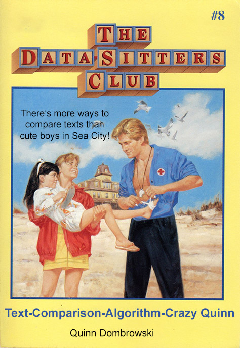

# DSC 8: Text-Comparison-Algorithm-Crazy Quinn

Welcome to the GitHub repo with the best version of this Data-Sitter's Club book! You can read it in its intended form [as a the Jupyter notebook](dsc8_text_comparison_algorithm_crazy_quinn.ipynb). It's our biggest book yet, longer than *California Diaries: Dawn 1*, so if GitHub gives you an error message when loading the notebook, reload and it should work. (New to Jupyter notebooks? [Check out this tutorial](https://programminghistorian.org/en/lessons/jupyter-notebooks).)

If you'd like to explore the data from this book, you can check out the [data folder](data), which has CSV files for all the distance calculations in the book, along with the tf-idf (most distinctive words) values for the books, and the chapter 2 6-gram values. The [viz folder](viz) has high-resolution version of all the visualizations.

And if you want just the code for using word count and term frequency vectorizers with cosine and Euclidean distance, you can use the [just-the-code notebook](dsc8_just_the_code.ipynb)... but you really should read the book first.